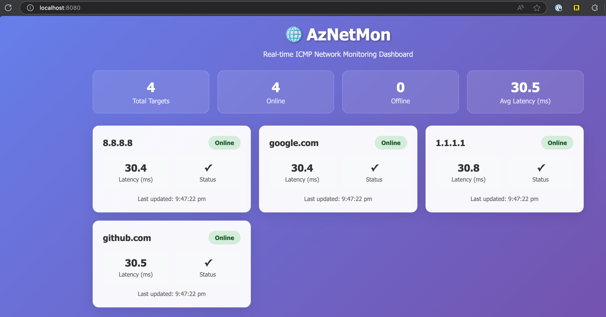

# 🌐 AzNetMon - Lightning Fast ICMP Network Monitor

<div align="center">


**A super lightweight and lightning-fast web application for real-time ICMP network monitoring**

[Features](#-features) • [Quick Start](#-quick-start) • [Docker](#-docker-deployment) • [API](#-api-documentation) • [Contributing](#-contributing)

</div>

---

## 📸 Live Dashboard

<div align="center">


*Real-time network monitoring with beautiful, responsive UI showing ping statistics and network health*
</div>

## ✨ Features

- 🚀 **Lightning Fast**: Built with Go for optimal performance and minimal latency
- 📊 **Real-time Dashboard**: Beautiful WebSocket-based live updates every 2 seconds
- 🐳 **Docker Ready**: Ultra-lightweight Alpine Linux container (~47MB)
- 🎯 **Multiple Targets**: Monitor unlimited IPs/hostnames simultaneously
- 📱 **Responsive Design**: Works perfectly on desktop, tablet, and mobile
- 🔧 **Zero Configuration**: Works out of the box with sensible defaults
- ⚡ **Minimal Resources**: ~5-10MB RAM usage, negligible CPU footprint
- 🌈 **Modern UI**: Clean, intuitive interface with real-time statistics
- 🔒 **Secure**: Runs as non-root user in container with minimal privileges
- 📈 **Metrics**: Average latency, success rates, and detailed error reporting

## 🚀 Quick Start

### One-Line Docker Deploy

```bash
docker run --cap-add=NET_RAW -p 8080:8080 -e ICMP_TARGETS="8.8.8.8,1.1.1.1,google.com" aznetmon:latest
```

Then open http://localhost:8080 in your browser! 🎉

### Local Development

1. **Prerequisites**: Go 1.24+ installed

2. **Clone and run**:
   ```bash
   git clone https://github.com/nthewara/aznetmon.git
   cd aznetmon
   go mod tidy
   sudo go run main.go -targets "8.8.8.8,1.1.1.1,google.com"
   ```

3. **Open dashboard**: http://localhost:8080

## 🐳 Docker Deployment

### Method 1: Quick Deploy Script
```bash
# Make script executable
chmod +x deploy.sh

# Deploy with default targets
./deploy.sh

# Deploy with custom targets and port
./deploy.sh "192.168.1.1,8.8.8.8,github.com" 3000
```

### Method 2: Docker Compose (Recommended)
```bash
# Start with default configuration
docker-compose up -d

# Start with custom targets
ICMP_TARGETS="192.168.1.1,8.8.8.8,github.com" docker-compose up -d

# View logs
docker-compose logs -f

# Stop
docker-compose down
```

### Method 3: Docker CLI
```bash
# Build image
docker build -t aznetmon .

# Run container
docker run -d \
  --name aznetmon \
  --cap-add=NET_RAW \
  -p 8080:8080 \
  -e ICMP_TARGETS="8.8.8.8,1.1.1.1,cloudflare.com" \
  --restart unless-stopped \
  aznetmon
```

## ⚙️ Configuration

### Command Line Arguments
| Flag | Description | Default | Example |
|------|-------------|---------|---------|
| `-targets` | Comma-separated list of IPs/hostnames | Required | `"8.8.8.8,google.com"` |
| `-port` | Web server port | `8080` | `3000` |

### Environment Variables
| Variable | Description | Example |
|----------|-------------|---------|
| `ICMP_TARGETS` | Target hosts (alternative to `-targets`) | `"8.8.8.8,1.1.1.1,github.com"` |

### Usage Examples

```bash
# Monitor single target
./aznetmon -targets "8.8.8.8"

# Monitor multiple targets
./aznetmon -targets "8.8.8.8,1.1.1.1,google.com,github.com"

# Custom port
./aznetmon -targets "8.8.8.8" -port 3000

# Using environment variable
export ICMP_TARGETS="192.168.1.1,8.8.8.8,cloudflare.com"
./aznetmon

# Docker with custom configuration
docker run --cap-add=NET_RAW -p 3000:8080 \
  -e ICMP_TARGETS="10.0.0.1,192.168.1.1" \
  aznetmon
```

## 📊 Dashboard Features

- **📈 Real-time Statistics**: Live counters for total targets, online/offline status, and average latency
- **🎯 Target Cards**: Individual status cards showing detailed metrics for each monitored host
- **⚡ Live Updates**: WebSocket-powered real-time updates without page refresh
- **🔍 Error Details**: Comprehensive error messages for debugging connectivity issues
- **📱 Mobile Friendly**: Fully responsive design that works on all screen sizes
- **🎨 Modern UI**: Beautiful gradient design with glassmorphism effects

## 📡 API Documentation

### REST Endpoints

| Endpoint | Method | Description | Response |
|----------|--------|-------------|----------|
| `/` | GET | Main dashboard interface | HTML |
| `/api/results` | GET | Current ping results | JSON |

### WebSocket Endpoint

| Endpoint | Protocol | Description |
|----------|----------|-------------|
| `/ws` | WebSocket | Real-time ping updates |

### API Response Example

```json
{
  "8.8.8.8": {
    "target": "8.8.8.8",
    "success": true,
    "duration_ms": 12.34,
    "timestamp": "2025-05-25T16:30:00Z"
  },
  "google.com": {
    "target": "google.com",
    "success": false,
    "duration_ms": 0,
    "error": "Request timeout",
    "timestamp": "2025-05-25T16:30:00Z"
  }
}
```

## 🔧 Requirements & Permissions

### ICMP Operations
AzNetMon requires `NET_RAW` capability to send ICMP packets:

| Platform | Requirement | Command |
|----------|-------------|---------|
| **Linux** | `sudo` or `CAP_NET_RAW` | `sudo ./aznetmon` or `sudo setcap cap_net_raw=ep ./aznetmon` |
| **macOS** | `sudo` | `sudo ./aznetmon` |
| **Docker** | `--cap-add=NET_RAW` | `docker run --cap-add=NET_RAW ...` |

### System Requirements
- **Memory**: ~5-10MB runtime
- **CPU**: Minimal usage (~0.1% on modern systems)
- **Network**: Outbound ICMP traffic
- **Go Version**: 1.24+ (for building from source)

## 🔧 Troubleshooting

### Common Issues

#### ICMP Socket Permission Error (Docker)
**Error**: `Failed to create ICMP socket: listen ipv4:icmp 0.0.0.0: socket: operation not permitted`

**Solution**: Ensure proper capabilities are set when running Docker containers:
```bash
# Correct way to run with Docker
docker run --cap-add=NET_RAW --cap-add=NET_ADMIN -p 8080:8080 aznetmon -targets=8.8.8.8,1.1.1.1

# Using docker-compose (capabilities already configured)
docker-compose up
```

**Note**: The container runs as root to allow ICMP socket creation, which is required for network monitoring.

#### WebSocket Connection Issues
**Symptoms**: 
- Dashboard not updating in real-time
- Multiple browser tabs causing inconsistent updates
- WebSocket connection errors in browser console

**Solution**: This has been fixed with per-connection write mutex implementation. Update to the latest version if experiencing these issues.

#### Permission Denied (Linux/macOS)
**Error**: `listen ipv4:icmp 0.0.0.0: socket: operation not permitted`

**Solutions**:
```bash
# Option 1: Run with sudo
sudo ./aznetmon -targets=8.8.8.8,1.1.1.1

# Option 2: Set capabilities (Linux only)
sudo setcap cap_net_raw=ep ./aznetmon
./aznetmon -targets=8.8.8.8,1.1.1.1
```

#### High CPU Usage
If experiencing high CPU usage:
1. Reduce number of targets
2. Increase ping interval (modify `time.Sleep(5 * time.Second)` in source)
3. Check for network connectivity issues causing timeouts

#### Browser Compatibility
- **Recommended**: Chrome, Firefox, Safari (latest versions)
- **WebSocket Support**: Required for real-time updates
- **JavaScript**: Must be enabled

### Performance Tips
- **Optimal Targets**: 5-20 hosts for best performance
- **Network**: Ensure stable internet connection
- **Resources**: Runs efficiently on systems with 1GB+ RAM
- **Monitoring**: Use browser developer tools to check WebSocket connections

**Docker Container Won't Start**
```bash
# Ensure NET_RAW capability is added
docker run --cap-add=NET_RAW -p 8080:8080 aznetmon

# Check logs
docker logs aznetmon
```

**WebSocket Connection Issues**
- Check firewall settings
- Ensure port is accessible
- Verify no proxy is blocking WebSocket connections

## 📦 Available Commands

Use the included Makefile for common tasks:

```bash
make help          # Show all available commands
make build         # Build the binary
make run           # Run locally with default targets
make docker-build  # Build Docker image
make docker-run    # Run Docker container
make compose-up    # Start with docker-compose
make clean         # Clean build artifacts
make test          # Run tests
```

## 🔍 Performance Metrics

| Metric | Value | Notes |
|--------|--------|-------|
| **Binary Size** | ~8MB | Single static binary |
| **Docker Image** | ~47MB | Alpine Linux based |
| **Memory Usage** | 5-10MB | Runtime memory footprint |
| **CPU Usage** | <0.1% | On modern hardware |
| **Startup Time** | <1 second | Ready to serve immediately |
| **Response Time** | <10ms | Dashboard load time |

## 🤝 Contributing

Contributions are welcome! Here's how you can help:

1. **Fork the repository**
2. **Create a feature branch**: `git checkout -b feature/amazing-feature`
3. **Commit your changes**: `git commit -m 'Add amazing feature'`
4. **Push to the branch**: `git push origin feature/amazing-feature`
5. **Open a Pull Request**

### Development Setup

```bash
# Clone your fork
git clone https://github.com/nthewara/aznetmon.git
cd aznetmon

# Install dependencies
go mod tidy

# Install development tools
make install-dev-tools

# Run in development mode (with hot reload)
make dev
```

### Development Dependencies

- **Go**: 1.24+
- **WebSocket**: github.com/gorilla/websocket v1.5.3
- **Net Package**: golang.org/x/net v0.40.0
- **Air**: Live reload tool (github.com/cosmtrek/air@latest)
- **Gosec**: Security scanner (github.com/securecodewarrior/gosec/v2)

### Areas for Contribution
- 🎨 UI/UX improvements
- 📊 Additional metrics and charts
- 🔧 Configuration options
- 🧪 Test coverage
- 📖 Documentation
- 🌍 Internationalization

## 📄 License

This project is licensed under the MIT License - see the [LICENSE](LICENSE) file for details.

## 🌟 Star History

If you find this project useful, please consider giving it a star! ⭐

## 📞 Support

- 🐛 **Bug Reports**: [GitHub Issues](https://github.com/nthewara/aznetmon/issues)
- 💡 **Feature Requests**: [GitHub Issues](https://github.com/nthewara/aznetmon/issues)
- 💬 **Discussions**: [GitHub Discussions](https://github.com/nthewara/aznetmon/discussions)

---

<div align="center">

**Made with ❤️ for the DevOps and SRE community**

*AzNetMon - Because network monitoring should be simple, fast, and reliable*

</div>
